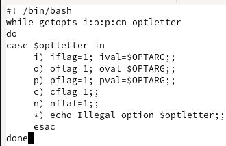
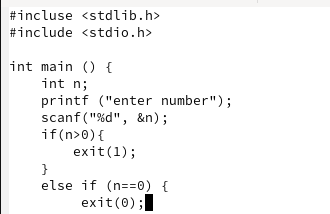
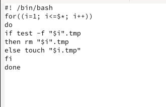
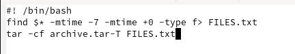

---
## Front matter
title: "Отчёт по лабораторной работе №12"
subtitle: "Дисциплина: Архитектура копьютера и операционные системы"
author: "Ванюшкина Татьяна Валерьевна"

## Generic otions
lang: ru-RU
toc-title: "Содержание"

## Bibliography
bibliography: bib/cite.bib
csl: pandoc/csl/gost-r-7-0-5-2008-numeric.csl

## Pdf output format
toc: true # Table of contents
toc-depth: 2
lof: true # List of figures
lot: true # List of tables
fontsize: 12pt
linestretch: 1.5
papersize: a4
documentclass: scrreprt
## I18n polyglossia
polyglossia-lang:
  name: russian
  options:
	- spelling=modern
	- babelshorthands=true
polyglossia-otherlangs:
  name: english
## I18n babel
babel-lang: russian
babel-otherlangs: english
## Fonts
mainfont: IBM Plex Serif
romanfont: IBM Plex Serif
sansfont: IBM Plex Sans
monofont: IBM Plex Mono
mathfont: STIX Two Math
mainfontoptions: Ligatures=Common,Ligatures=TeX,Scale=0.94
romanfontoptions: Ligatures=Common,Ligatures=TeX,Scale=0.94
sansfontoptions: Ligatures=Common,Ligatures=TeX,Scale=MatchLowercase,Scale=0.94
monofontoptions: Scale=MatchLowercase,Scale=0.94,FakeStretch=0.9
mathfontoptions:
## Biblatex
biblatex: true
biblio-style: "gost-numeric"
biblatexoptions:
  - parentracker=true
  - backend=biber
  - hyperref=auto
  - language=auto
  - autolang=other*
  - citestyle=gost-numeric
## Pandoc-crossref LaTeX customization
figureTitle: "Рис."
tableTitle: "Таблица"
listingTitle: "Листинг"
lofTitle: "Список иллюстраций"
lotTitle: "Список таблиц"
lolTitle: "Листинги"
## Misc options
indent: true
header-includes:
  - \usepackage{indentfirst}
  - \usepackage{float} # keep figures where there are in the text
  - \floatplacement{figure}{H} # keep figures where there are in the text
---

# Цель работы

  Изучить основы программирования в оболочке ОС UNIX/Linux. Научиться писать небольшие командные файлы.

# Выполнение лабораторной работы

Пишу скрипт,который при запуске будет делать резервную копию самого себя (то есть файла, в котором содержится его исходный код) в другую директорию backup в домашнем каталоге.При этом файл должен архивироваться одним из ар
хиваторов на выбор zip, bzip2 или tar. 

(рис.1 [-@fig:001])
{#fig:001 width=70%}
{#fig:001}

(рис.2 [-@fig:002])
{#fig:002 width=70%}
{#fig:002}

Пишу пример командного файла,обрабатывающего любое произвольное число аргументов командной строки,втом числе превышающее десять.

(рис.3 [-@fig:003])
{#fig:003 width=70%}
{#fig:003}

Пишу командный файл—аналог команды ls (без использования самой этой команды и команды dir).

(рис.4 [-@fig:004])
{#fig:004 width=70%}
{#fig:004}

Пишу командный файл,который получает в качестве аргумента командной строки формат файла (.txt, .doc, .jpg, .pdf и т.д.) и вычисляет количество таких файлов
 в указанной директории.Путь к директории также передаётся в виде аргумента командной строки
 
(рис.5 [-@fig:005])
{#fig:005 width=70%}
{#fig:005}

# Выводы

В ходе выполнения лабораторной работы я научилась писать небольшие командные файлы и обрела навыки программирования в оболочке ОС UNIX/Linux 
# Список литературы{.unnumbered}

Курс: Архитектура компьютеров и операционные системы. Раздел "Операционные системы" (02.03.00, УГСН) (rudn.ru)
