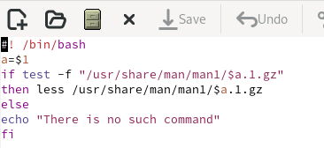

---
## Front matter
lang: ru-RU
title: Программирование в командном процессоре ОС UNIX.Командные файлы
subtitle: Дисциплина:Архитектура компьютера и операционные системы
author:
  - Ванюшкина Т.В.
institute:
  - Российский университет дружбы народов, Москва, Россия
date: 24 апреля 2025

## i18n babel
babel-lang: russian
babel-otherlangs: english

## Formatting pdf
toc: false
toc-title: Содержание
slide_level: 2
aspectratio: 169
section-titles: true
theme: metropolis
header-includes:
 - \metroset{progressbar=frametitle,sectionpage=progressbar,numbering=fraction}
---

# Информация

## Докладчик


  * Ванюшкина Татьяна Валерьевна
  * группа НКАбд-01-24
  * Российский университет дружбы народов

## Цели и задачи

- Изучить основы программирования в оболочке ОС UNIX/Linux. 
- Научиться писать небольшие командные файлы.

## Материалы и методы

- Курс: Архитектура компьютеров и операционные системы. Раздел "Операционные системы" (02.03.00, УГСН) (rudn.ru)

# Создание презентации

## Скрипт 1

Пишу скрипт,который при запуске будет делать резервную копию самого себя (то есть файла, в котором содержится его исходный код) в другую директорию backup в домашнем каталоге.При этом файл должен архивироваться одним из ар
хиваторов на выбор zip, bzip2 или tar. 

(рис.1 [-@fig:001])
{#fig:001 width=70%}
{#fig:001}


(рис.2 [-@fig:002])
{#fig:002 width=70%}
{#fig:002}

## Скрипт 2

Пишу пример командного файла,обрабатывающего любое произвольное число аргументов командной строки,втом числе превышающее десять.

(рис.3 [-@fig:003])
{#fig:003 width=70%}
{#fig:003}

## Скрипт 3

Пишу командный файл—аналог команды ls (без использования самой этой команды и команды dir).

(рис.4 [-@fig:004])
{#fig:004 width=70%}
{#fig:004}

## Скрипт 4

Пишу командный файл,который получает в качестве аргумента командной строки формат файла (.txt, .doc, .jpg, .pdf и т.д.) и вычисляет количество таких файлов
 в указанной директории.Путь к директории также передаётся в виде аргумента командной строки
 
(рис.5 [-@fig:005])
{#fig:005 width=70%}
{#fig:005}

# Резулитаты 

В ходе выполнения лабораторной работы я научилась писать небольшие командные файлы и обрела навыки программирования в оболочке ОС UNIX/Linux 


## Код для формата `pdf`

```yaml
slide_level: 2
aspectratio: 169
section-titles: true
theme: metropolis
```

## Код для формата `html`

- Тема задаётся в файле `Makefile`

```make
REVEALJS_THEME = beige 


